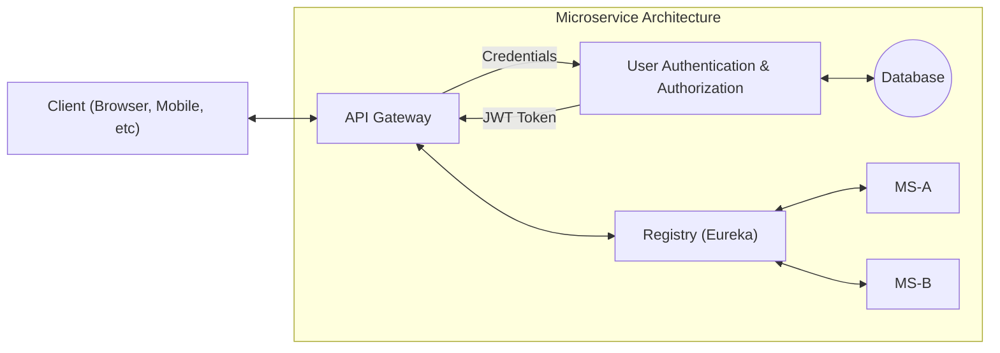

# Execution guide

### Technologies used

* spring boot
* lombok
* junit5 (jupiter)
* maven as a build tool
* flyway as a database script manager
* java 8
* spring security
* jwt token
* spring Eureka as a service registry
* spring Admin as a monitoring
* spring Gateway

---
**Architectural Diagram**

--- 

### Guides
This project consists of 6 modules as follows:

* **Module Gateway** :
This module works on port 8080. Spring gateway has been used to implement it.
All requests are sent to this module and first the user uses links as follows
``` 
http://localhost:8080/auth/login
http://localhost:8080/auth/refresh
``` 
to send a request to UAA for authentication and getting a token. After authentication, all requests will be sent to the Gateway with using the received token.

* **Module Monitoring** :
This module works on port 8085. Spring admin has been used to implement it. The task of this module is to monitor microservices.

* **Module ًRegistry** :
This module works on port 8083. Spring eureka has been used to implement it.
All services register themselves here.

* **Module َUAA** :
This module works on port 8084. Spring security has been used to implement it.
Authentication and authorization of user is done here with the 
help of JWT token;

* **Module SavingsA** :
According to the question

* **Module SavingsB** :
According to the question

---

### Description
The (Kadmos.postman_collection.json) file is available in docs path, 
you can import it in your own Postman and use it.
There are also photos of Monitoring server and Registry server.
All modules are executable and work perfectly.

You can create an image for Docker from any module using the following command.
```
mvn clean package docker:build
```

---
### Questions
* scale your API gateway?

I think by using containerization, 
deploy gateway as a container in Kubernetes cluster.
